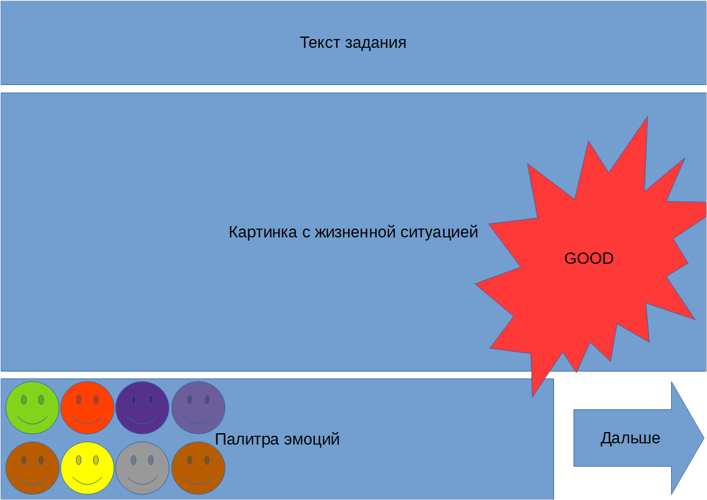

# EmoDetect

## Приложение для определения сформированности эмоциональной сферы ребенка

## Информация о проекте 

**Заказчик** - Гобу Мурманской области центр психолого-педагогической, медицинской и социальной помощи

**Исполнители**:

* Сумина Дарья (студентка 4 курса, группа МКН)
* Ляш Олег Иванович (руководитель)

## Сценарий

1. Экран с приветствием и выбором аватара.
    После выбора надо сразу перейти к экрану с 3-мя видами заданий
2. Экран с заданиями (всего 3 типа)
3. Задание 1 "Укажи правильно эмоцию". На верху появлется текст задания.
Основную часть экрана занимает картинка с жизненной ситуацией
внизу расположена палитра эмоций и кнопка перехода к следующему заданию   
4. Задание 2 ""
5. Задание 3 "" 

## Интерфейс

Ниже представлено схематичное изображение интерфейса

## ToDO (или что еще надо сделать)

* Формирование карточек
* Определение выбранной карточки и соответствующей ей эмоции
* Подсчет баллов
* Сохранение статистики
* Нарисовать картинки  